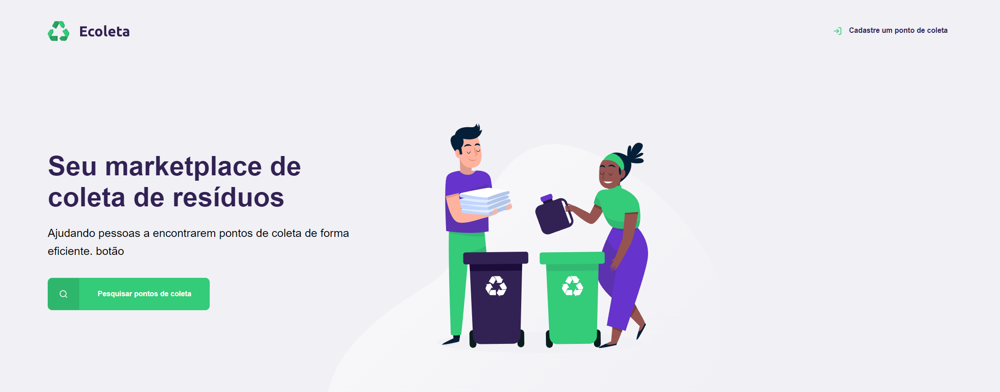

<h1 align="center">
    Next Level Week | NLW#1
</h1>

<p align="center">
  
</p>

## ♻️ Sobre o projeto:
O Ecoleta é um projeto sobre a criação e localização de pontos de coleta de lixo, foi a primeira aplicação que fiz durante um evento de programação.

## 🚀 Tecnologias Usadas:

- [HTML](https://www.w3schools.com/html/)
- [CSS](https://developer.mozilla.org/pt-BR/docs/Web/CSS)
- [Javascript](https://developer.mozilla.org/pt-BR/docs/Aprender/JavaScript)
- [NodeJS](https://nodejs.org/)
- [JSON](https://www.json.org/json-pt.html)
- [SQLite](https://www.sqlite.org/index.html)

## 💻 Como executar:

1.  **Clone o projeto.**

    ```shell
    git clone 
    ```

2.  **Instalação**

    Instale as dependencias da aplicação.

    ```shell
    npm install
    ```

3.  **Rode a Aplicação**

    ```shell
    npm start
    ```
    
 ## ℹ️ Resultados:
 
  

## 📝 License

Esse projeto está sob a licença MIT. Veja o arquivo [LICENSE](LICENSE.md) para mais detalhes.

---

<h4 align="center">
    Desenvolvido por <a href="https://www.linkedin.com/in/gabriel-jony/">Gabriel Jony</a>
</h4>
